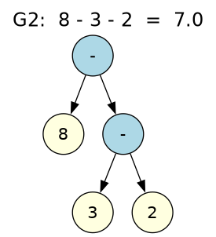
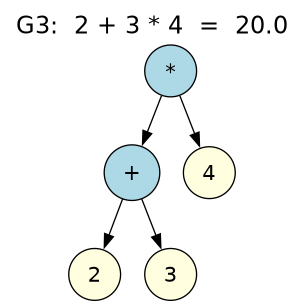

# Gramáticas aritméticas con ANTLR4: precedencia y asociatividad

Proyecto de la materia **Lenguajes de Programación**. Se diseñan cuatro gramáticas libres de contexto (GLC) en ANTLR4 que reconocen expresiones aritméticas con suma, resta, multiplicación, división y paréntesis. Cada gramática cambia **una sola propiedad** (asociatividad o precedencia) para estudiar cómo esa decisión modifica el árbol de sintaxis abstracta (AST) y, en algunos casos, el resultado de la evaluación.

Las expresiones se evalúan con el **patrón Visitor** en Python, y los AST se grafican con **Graphviz**.

---

## Gramáticas

| Gramática | Precedencia | Asociatividad | Ejemplo clave |
|---|---|---|---|
| **G1** | `* /` > `+ -` (normal) | Izquierda | `8 - 3 - 2 = 3` |
| **G2** | `* /` > `+ -` (normal) | **Derecha** | `8 - 3 - 2 = 7` |
| **G3** | **`+ -` > `* /` (invertida)** | Izquierda | `2 + 3 * 4 = 20` |
| **G4** | **`/` > `*` > `-` > `+`** (un nivel por operador) | Izquierda | `0.1 * 3 / 3 = 0.1` |

### G1: asociatividad izquierda, precedencia normal

```
e → e + t | e − t | t
t → t * f | t / f | f
f → ( e ) | num
```

La recursión por la izquierda (`e → e + t`) hace que las operaciones del mismo nivel se agrupen de izquierda a derecha. Es la convención matemática usual.

### G2: asociatividad derecha, precedencia normal

```
e → t + e | t − e | t
t → f * t | f / t | f
f → ( e ) | num
```

Se invierte la recursión (`e → t + e`), así que las operaciones del mismo nivel se agrupan de derecha a izquierda. La suma y la multiplicación no cambian de resultado, porque son asociativas, pero la resta y la división sí.

### G3: asociatividad izquierda, precedencia invertida

```
e → e * t | e / t | t
t → t + f | t − f | f
f → ( e ) | num
```

Se intercambian los operadores entre los niveles `e` y `t`. Como el nivel más profundo del árbol es el que se evalúa primero, ahora la suma y la resta tienen más prioridad que la multiplicación y la división.

### G4: un nivel de precedencia por operador

```
suma   → suma + resta   | resta
resta  → resta − mult   | mult
mult   → mult * div     | div
div    → div / factor   | factor
factor → ( suma ) | num
```

Cada operador tiene su propio nivel, con prioridad `/` > `*` > `-` > `+`. En aritmética exacta los resultados coinciden con G1 (por ejemplo, `a * b / c = a * (b / c)`), pero el árbol es distinto. La diferencia se hace visible con números decimales, por los errores de redondeo del punto flotante.

---

## Estructura del repositorio

```
.
├── G1.g4                 # Gramática G1
├── G2.g4                 # Gramática G2
├── G3.g4                 # Gramática G3
├── G4.g4                 # Gramática G4
├── EvalVisitor.py        # Evaluador (Visitor) de G1
├── EvalVisitorG2.py      # Evaluador de G2
├── EvalVisitorG3.py      # Evaluador de G3
├── EvalVisitorG4.py      # Evaluador de G4
├── main.py               # Programa principal de G1
├── mainG2.py             # Programa principal de G2
├── mainG3.py             # Programa principal de G3
├── mainG4.py             # Programa principal de G4
├── graficar_ast.py       # Construye, evalúa y grafica los AST de cualquier gramática
├── pruebas.txt           # Expresiones de prueba (precedencia, asociatividad, errores)
├── pruebas_g4.txt        # Expresiones de prueba para G4
├── ast_G1/ … ast_G4/     # AST generados (.dot y .png)
├── ast_G1_g4/            # AST de G1 con pruebas_g4.txt (para comparar con G4)
└── G*Lexer.py, G*Parser.py, G*Visitor.py   # Código generado por ANTLR
```

---

## Requisitos

- Ubuntu (o cualquier Linux)
- Python 3
- Java (lo necesita ANTLR)
- ANTLR 4.13.2
- Graphviz (para graficar los AST)

## Instalación

```bash
git clone https://github.com/yslen2421/Cambios-en-la-aritmetica.git
cd Cambios-en-la-aritmetica

python3 -m venv venv
source venv/bin/activate
pip install antlr4-python3-runtime==4.13.2 antlr4-tools

sudo apt install graphviz -y
```

> La versión de `antlr4-python3-runtime` debe coincidir con la versión de ANTLR usada para generar el código.

## Generar el lexer, el parser y el visitor

```bash
for g in G1 G2 G3 G4; do
    antlr4 -Dlanguage=Python3 -visitor -no-listener $g.g4
done
```

## Uso

### Evaluar expresiones

Modo archivo (evalúa cada línea):

```bash
python3 main.py pruebas.txt      # G1
python3 mainG2.py pruebas.txt    # G2
python3 mainG3.py pruebas.txt    # G3
python3 mainG4.py pruebas_g4.txt # G4
```

Modo interactivo (escribe `salir` para terminar):

```bash
python3 main.py
```

Las expresiones mal escritas se reportan como inválidas, y la división por cero muestra un mensaje de error en lugar de detener el programa.

### Graficar los AST

```bash
python3 graficar_ast.py G1 pruebas.txt
```

El script construye el AST de cada expresión (solo operadores y números, sin paréntesis ni nodos intermedios), lo evalúa, lo imprime en texto con paréntesis explícitos y guarda la imagen en `ast_G1/prueba_XX.png`. Funciona con las cuatro gramáticas:

```bash
for g in G1 G2 G3; do python3 graficar_ast.py $g pruebas.txt; done
python3 graficar_ast.py G4 pruebas_g4.txt
```

### Ver el árbol sintáctico completo de ANTLR

```bash
echo "2 + 3 * 4" | antlr4-parse G1.g4 prog -gui
```

---

## Resultados

### Asociatividad (G1 vs G2)

| Expresión | G1 (izquierda) | G2 (derecha) |
|---|---|---|
| `8 - 3 - 2` | `((8 - 3) - 2)` = **3.0** | `(8 - (3 - 2))` = **7.0** |
| `100 / 10 / 2` | `((100 / 10) / 2)` = **5.0** | `(100 / (10 / 2))` = **20.0** |

| G1 | G2 |
|---|---|
|  |  |

### Precedencia (G1 vs G3)

| Expresión | G1 (`*/` primero) | G3 (`+-` primero) |
|---|---|---|
| `2 + 3 * 4` | `(2 + (3 * 4))` = **14.0** | `((2 + 3) * 4)` = **20.0** |
| `3.5 * 2 + 1` | `((3.5 * 2) + 1)` = **8.0** | `(3.5 * (2 + 1))` = **10.5** |

| G1 | G3 |
|---|---|
|  |  |

### Paréntesis

`(2 + 3) * 4` produce el mismo AST y el mismo resultado (**20.0**) en G1, G2 y G3: los paréntesis tienen la máxima prioridad sin importar la gramática.

### Un nivel por operador (G1 vs G4)

| Expresión | G1 | G4 |
|---|---|---|
| `2 * 8 / 4` | `((2 * 8) / 4)` = **4.0** | `(2 * (8 / 4))` = **4.0** |
| `0.1 * 3 / 3` | `((0.1 * 3) / 3)` = **0.10000000000000002** | `(0.1 * (3 / 3))` = **0.1** |
| `0.1 + 0.2 - 0.3` | `((0.1 + 0.2) - 0.3)` = **5.55e-17** | `(0.1 + (0.2 - 0.3))` = **2.78e-17** |

Los árboles son distintos aunque en aritmética exacta el resultado sea el mismo; el orden de evaluación solo se nota por el redondeo del punto flotante.

---

## Conclusiones

- La **precedencia** se define por el nivel de la gramática en el que aparece cada operador: cuanto más profundo queda en el árbol, antes se evalúa.
- La **asociatividad** se define por el lado de la recursión: recursión por la izquierda agrupa de izquierda a derecha, y recursión por la derecha, al revés.
- La asociatividad solo cambia el resultado en operaciones **no asociativas** (resta y división).
- Dos gramáticas pueden generar el mismo lenguaje (las mismas cadenas válidas) y aun así asignarles árboles, y por tanto significados, diferentes.
